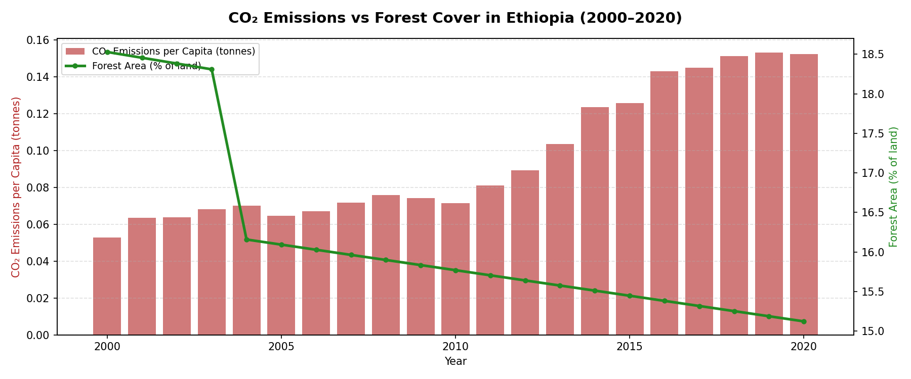
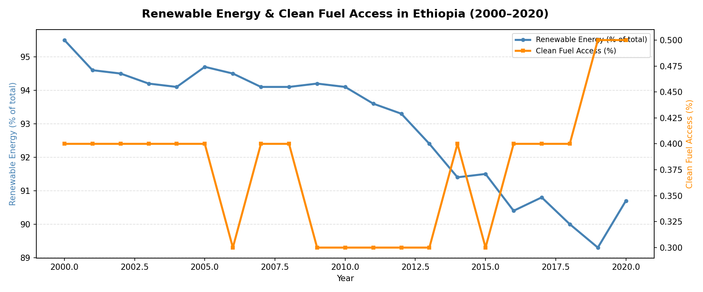
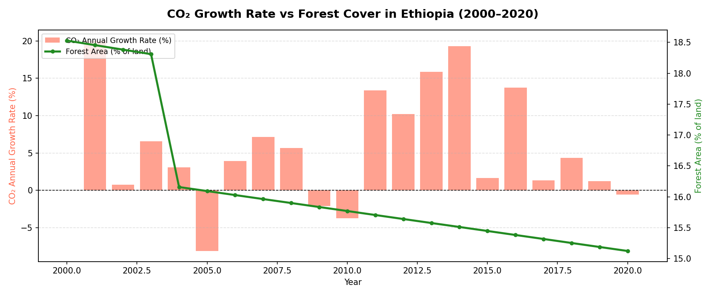

# 🌿 Ethiopia Carbon Market & Environmental Analysis (2000–2020)

**Tools:** Python · Pandas · Matplotlib · Google Colab
**Data Source:** World Bank Development Indicators
**Context:** Ethiopia's National Carbon Market Strategy (NCMS) 2025–2035

## Overview
This project visualizes key environmental indicators relevant to Ethiopia's
National Carbon Market Strategy (NCMS) 2025–2035. Ethiopia aims to leverage
carbon markets — particularly REDD+ forestry credits and renewable energy
projects — to bridge its climate finance gap while pursuing sustainable
development. The charts track CO₂ emissions, forest cover, clean fuel access,
and renewable energy consumption over two decades.

## Charts
| Chart | Indicators |
|---|---|
| CO₂ & Forest Cover | CO₂ Emissions per Capita · Forest Area (% of land) |
| Energy Transition | Renewable Energy (%) · Clean Fuel Access (%) |
| CO₂ Growth Rate | CO₂ Annual Growth Rate · Forest Area (% of land) |

## Visualizations

## How to Run
1. Open the `.ipynb` file in [Google Colab](https://colab.research.google.com/)
2. Upload the 4 World Bank CSV files when prompted
3. Run all cells to generate the three charts
